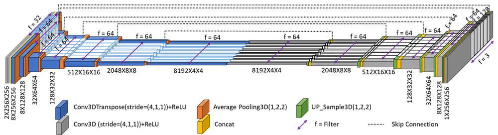

# SF_Net: Frame Interpolation Network

SF_Net (Square Funnel Frame interpolation Network) is an advanced neural network model for video frame interpolation, designed to generate intermediate frames between existing video frames. This creates smoother motion in videos by effectively increasing the frame rate.

This implementation is based on our published work (see the [Published Paper](#-published-paper) section below for details).

## 📄 Published Paper

This repository contains the official implementation of the following published paper:

> **H. Azadegan and A.-A. Beheshti Shirazi**,  
> *SF-Net: Video Frame Interpolation With a 3D Square Funnel Network*,  
> IET Image Processing, vol. 19, no. 1, e70193, 2025.  
> [https://doi.org/10.1049/ipr2.70193](https://doi.org/10.1049/ipr2.70193)


## Project Structure

```
SF_Net/
├── config/                    # Model configuration files
│   ├── azadegan_net-Style.gin # Main model configuration
│   └── ...                    # Other configuration variants
├── scripts/                   # Evaluation and training scripts
│   ├── eval.py                # Main evaluation script using gin config
│   ├── eval1.py               # Alternative evaluation script with custom datasets
│   └── ...                    # Other utility scripts
├── saved_model/               # Pre-trained TensorFlow model directory
├── src/                       # Source code
│   ├── data/                  # Data loading and processing
│   ├── models/                # Model architecture definitions
│   └── utils/                 # Utility functions and metrics
└── README.md                  # This file
```

## Model Details

SF_Net uses a specialized architecture based on a pyramid design for frame interpolation:

- **Model Type**: azadegan_net (variant of FILM-Net)
- **Architecture**: The SF-Net model uses two encoders and decoders. The encoder performs three 3D convolutions on all frames and combines them, followed by a 3D transpose convolution with a stride of (4, 1, 1) and average pooling, repeating for up to 6 stages. The decoder reverses these operations, applying 3D convolution and up-sampling, merging with corresponding encoder layers. This process continues through six layers, resulting in a frame of dimensions (W x H x 3) in the seventh layer of the decoder.
- **Loss Functions**: Combination of L1 (pixel), VGG (perceptual), and Style losses
- **Input**: Two consecutive video frames
- **Output**: Intermediate frame(s) at specified time step(s)



## Requirements

### System Requirements

- **Anaconda Python 3.9**
- **CUDA Toolkit 11.2.1**
- **cuDNN 8.1.0**

### Dependencies

```
tensorflow==2.6.2  # Includes tensorflow-gpu
tensorflow-datasets==4.4.0
tensorflow-addons==0.15.0
absl-py==0.12.0
gin-config==0.5.0
parameterized==0.8.1
mediapy==1.0.3
scikit-image==0.19.1
apache-beam==2.34.0
google-cloud-bigquery-storage==1.1.0  # Suppresses a harmless error from beam
natsort==8.1.0
gdown==4.5.4
tqdm==4.64.1
```

## Installation

1. Clone the repository:
   ```bash
   git clone https://github.com/username/SF_Net.git
   cd SF_Net
   ```

2. Install dependencies:
   ```bash
   pip install -r requirements.txt
   ```

3. Ensure the model paths in scripts/eval.py and scripts/eval1.py match your system setup.

## Datasets

### Training Dataset

- **Vimeo-90K**: Main training dataset used for model training

### Test Datasets

- **Vimeo-90K**: Standard benchmark for video frame interpolation
- **Middlebury-Other**: Dataset with complex motions
- **UCF101**: Action recognition dataset used for evaluation
- **Xiph**: High-resolution video dataset
- **SNU-FILM**: Dataset with varying frame rates

## Running the Model

### Using the Original Evaluation Script

This script uses the dataset paths specified in the gin configuration:

```bash
python scripts/eval.py
```

### Using the Alternative Evaluation Script

This script allows specifying custom evaluation datasets:

```bash
python scripts/eval1.py
```

### Path Configuration

Both evaluation scripts have the following paths that should be verified or modified to match your system:

```python
BASE_FOLDER = 'D:/azadegan/frame-interpolation/Checkpoint'
LABEL = 'run0'
EVAL_FOLDER = os.path.join(BASE_FOLDER, LABEL, 'eval')
SAVED_MODEL_FOLDER = os.path.join(BASE_FOLDER, LABEL, 'saved_model')
GIN_CONFIG = 'D:/azadegan/frame-interpolation/US/config/azadegan_net-Style.gin'
```

In eval1.py, the dataset paths are additionally configured:

```python
EVAL_FILES = ['D:/azadegan/frame-interpolation/datasets/eval_dataset@10']
EVAL_NAMES = ['eval_dataset']
```

## Troubleshooting

### Common Issues

1. **TensorFlow Import Error**: Make sure TensorFlow and its dependencies are correctly installed for your Python version.

2. **GPU Memory Error**: If you encounter GPU memory errors, try reducing the batch size in the evaluation scripts.

3. **File Not Found Errors**: Verify all file paths match your system setup, especially the model paths and dataset locations.

4. **TensorFlow Addons Missing**: Install TensorFlow Addons with the appropriate version for your TensorFlow installation.

### Debug Options

- Both evaluation scripts include detailed logging to help diagnose issues.
- Check the console output for error messages and file path issues.
- Ensure all necessary directories exist before running the scripts.

## Citation
If you use this code, please cite the following paper:

```bibtex
@article{Azadegan2025SFNet,
  author  = {Azadegan, Hamid and Beheshti Shirazi, Ali-Asghar},
  title   = {SF-Net: Video Frame Interpolation With a 3D Square Funnel Network},
  journal = {IET Image Processing},
  year    = {2025},
  volume  = {19},
  number  = {1},
  pages   = {e70193},
  doi     = {10.1049/ipr2.70193}
}
```

## License

This project is licensed under the Apache License 2.0 - see the LICENSE file for details.
